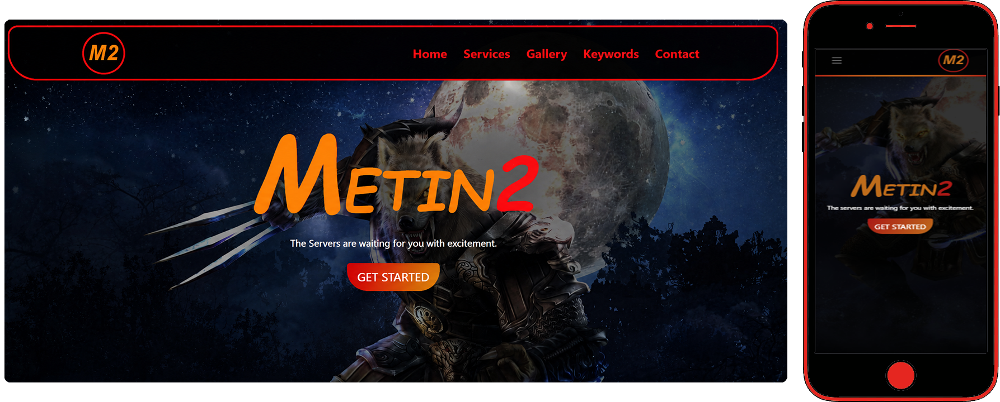

# Responsive-One-Page-Bootstrap-jQuery-Metin2-WebSite
This project uses HTML, CSS, JavaScript, Bootstrap, and jQuery; CSS, JavaScript, and jQuery were also used extensively for animations and filtering in the gallery section.

# Pages:
* index
    * home
    * services
    * gallery
    * keywords
    * contact

# Image

<picture>

</picture>
